# NiFi のテストの仕方

作成した NiFi を動かすときは、まずプロセッサーをひとつずつ（データを１件ずつ）テストしてから、全体のフローをテストすることをおすすめします。

## テストの前に

プロセッサーの左上のマークは、プロセッサーの状態を表します。

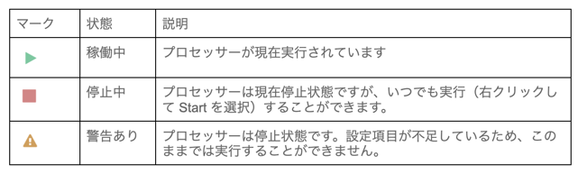

警告ありの状態になっていると、プロセッサーを動かすことができません。  
警告マークの上でカーソルをホバーすると、警告の内容が表示されます。

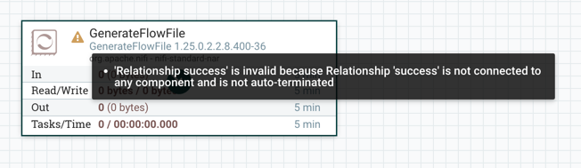

（参考：上記はリレーションシップが終結していないというエラーです）

警告の内容を参考に、設定を修正し稼働可能な状態（停止中）にした上で、テストを開始します。

## プロセッサーをひとつずつテストする

### Listen系プロセッサーの場合

Listen系のプロセッサーを処理の先頭に置いている場合は、そのプロセッサーを右クリックし、Startをクリックします。

該当のプロセッサーに緑の再生マークがつけばOKです。

この状態で、Listen対象となる処理を稼働します。

データが入ってくると、後続のキューにデータがたまります。

### Listen系以外のプロセッサーの場合

作成したプロセッサーを右クリックし、RunOnceをクリックします。

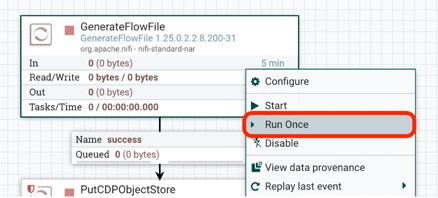

こうすることで、該当のプロセッサーが一度だけ処理されます。
後続のプロセッサーにデータがたまっていることを確認します。

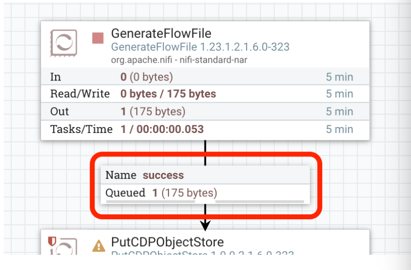

### キュー上のフローファイルを確認する

キューにたまったデータを確認するには、キューを右クリックし List queue を選択します。

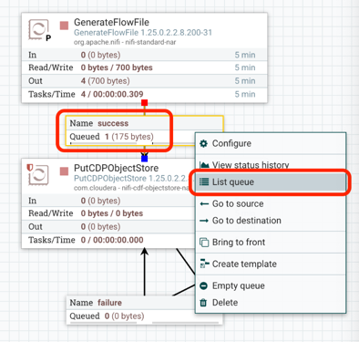

データの一覧が表示されます。

#### Content の確認

データの中身(content)を確認するには、該当のフローファイルの右側にある目玉のマークをクリックします。

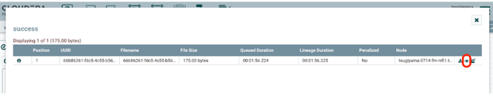

以下のように、contentの中身が表示されます。

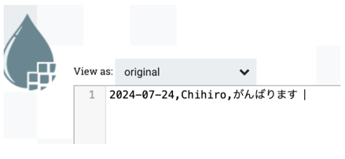

#### Attribute の確認

フローファイルのメタデータ（Attribute）を確認するには、該当のフローファイルの右側にある！マークをクリックします。

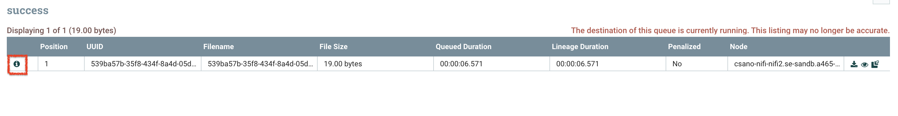

Atrributeの情報が表示されます。

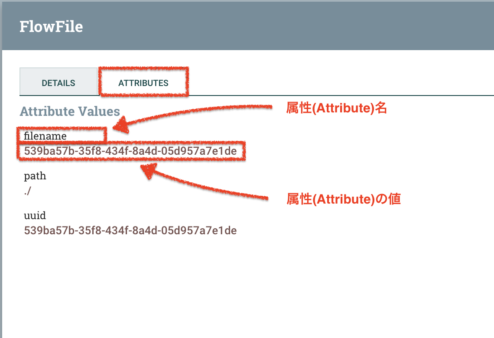

以上のプロセスを繰り返し、個々のプロセッサーの処理が想定どおりになっていることを確認します。
個々のプロセッサーの処理が想定どおりになっていることを確認したら、フロー全体をテストします。

## フロー全体をテストする

テストしたいフローのキャンバスを右クリックし、Startを選択します。

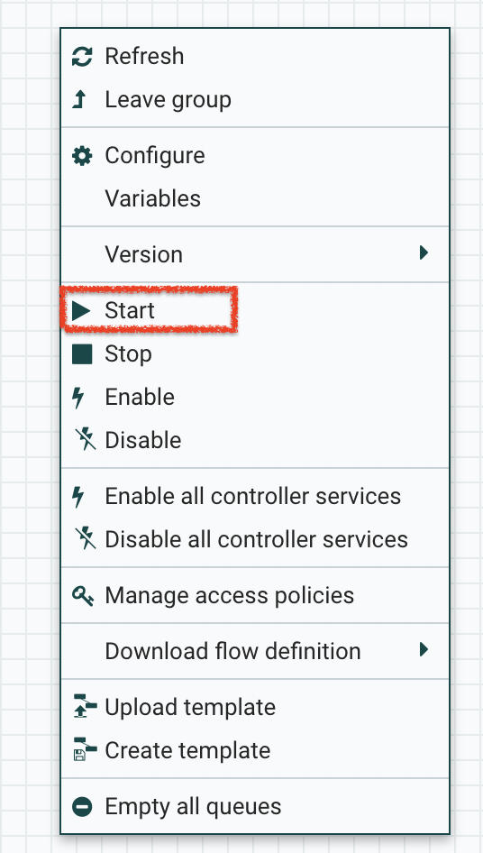

フロー全体が稼働します。

## エラーになったら

エラーが出ると、エラーが出たプロセッサー上で以下のようにエラーメッセージのマークが表示されます。
エラーメッセージのマークをホバーすると、エラー内容が表示されます。

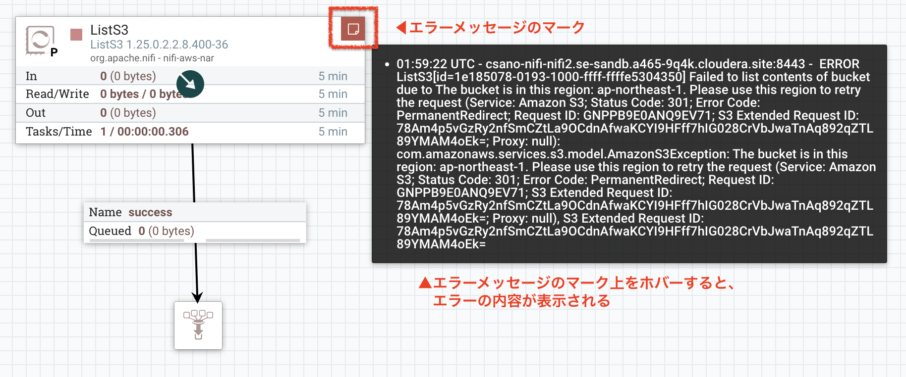

また、画面右上のハンバーガーマークから Bulletin Board を選択することで、エラーの一覧を表示することも可能です。

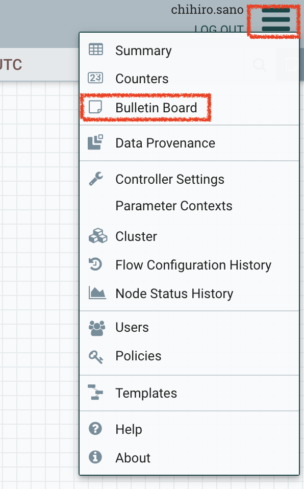

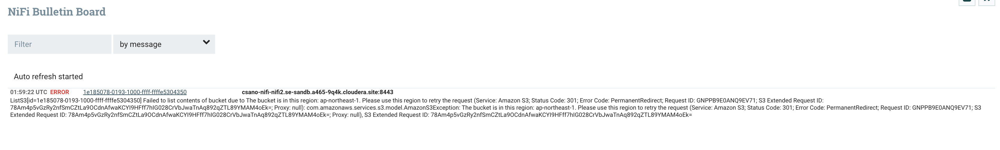

これらのメッセージを参考にエラー部分を修正し、テストを進めます。
