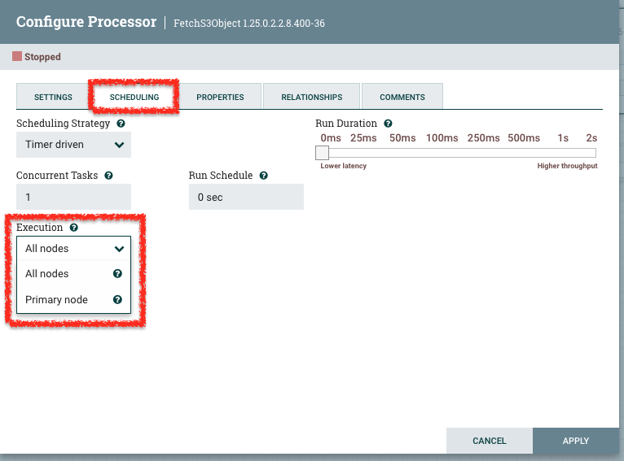
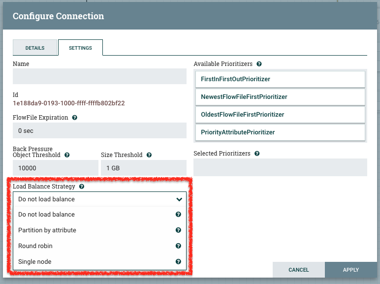

# 分散処理の考慮ポイント

NiFi を分散処理させる場合の考慮ポイントをまとめます。
（随時更新）

## プライマリーノード

クラスターのリーダーとなるノードをプライマリーノードといいます。  
プライマリーノードは自動選出されるため、ユーザーが固定のノードをプライマリーノードに指定することはできません。

## 単一ノード処理／分散処理

各処理を単一ノードで行うか、分散処理するかを選択する必要があります。  
単一ノードで行うか、分散処理するかの設定は、プロセッサーの Scheduling タブで設定することができます。

Primary node を選択すると、Primaryノードによるシングルノード処理が行われます。  
All nodes を選択すると、クラスタ内の全ノードによる分散処理が行われます。

一般的に、List系の処理はシングルノードで行います。

## 単一ノードで処理したあとの分散

単一ノードで処理したあとの後続処理を分散するためには、後続のキューでロードバランシング戦略を指定する必要があります。

キューを右クリック -> Configure を選択した画面で、ロードバランシング戦略を指定することができます。

一般的には、Round robin を選択することで後続処理を分散します。

## 分散処理 -> 分散処理　のキュー制御

All nodes で処理したあとの処理を引き続き All nodes で行う場合、一般的には Do not load balance を選択します。  
これにより、フローファイルがむやみにネットワークを通ることを避け、各ノードで効率よく分散処理を行うことが可能です。