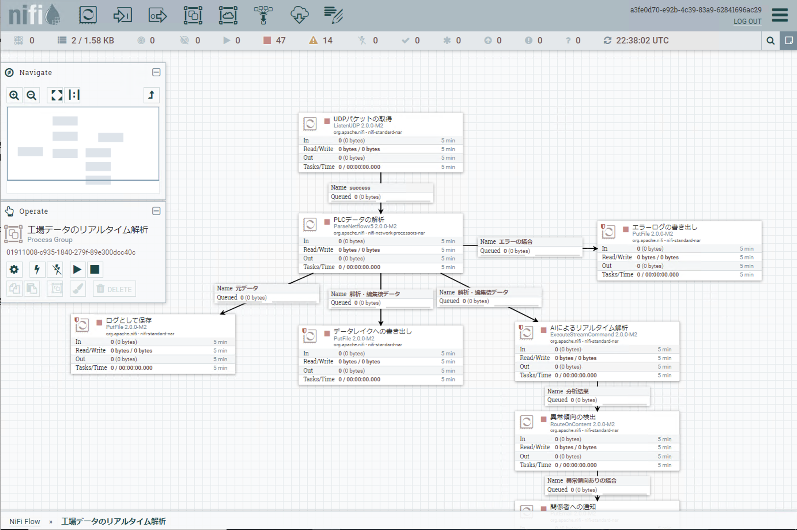
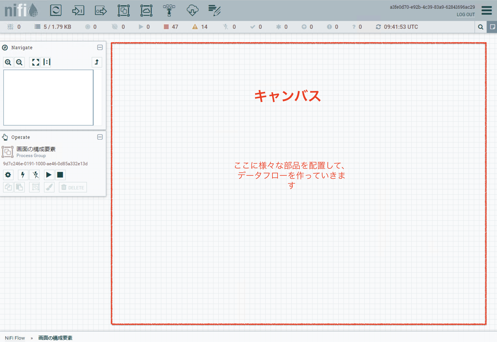
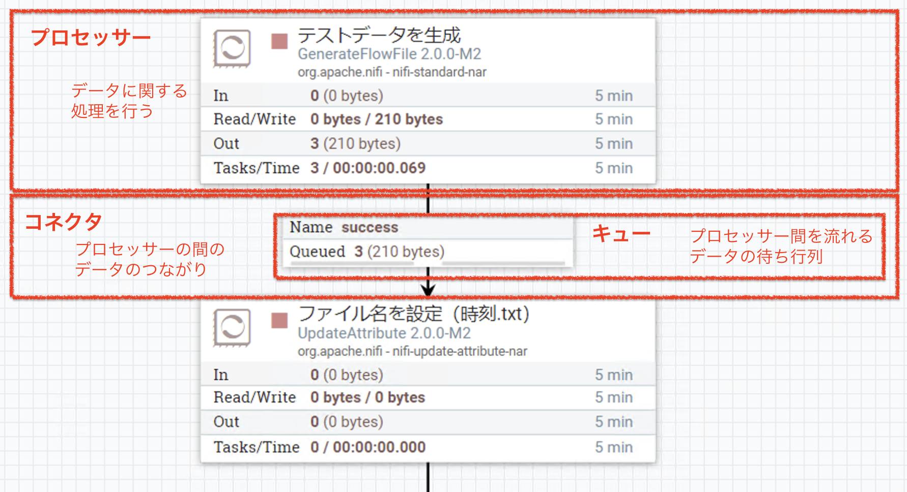
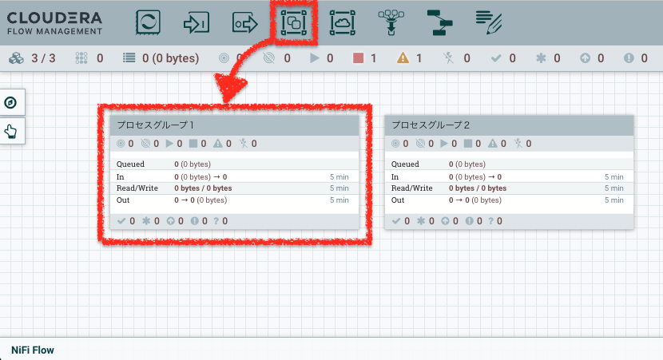
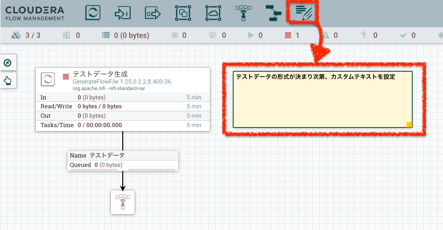

# この記事について

NiFi という名前を今日初めて知った！ という人でも、「ひとまずここらへんの用語をおさえておけば、NiFi猛者たちの話についていける」という用語集を目指してまとめます。

内容は随時充実させていきます！

# そもそも NiFi ってどんなもの？

Apache NiFi は、GUIでデータパイプラインを作れるオープンソースツールです。

↑上記のような画面で、データのフローを絵に描くような感覚でそのまま実装ができます。

# NiFi 用語集

## 画面の構成要素

### キャンバス

NiFi の画面上の方眼紙のような部分を、キャンバスといいます。

ここにプロセッサーを配置し、コネクタでつないでフローを作っていくのが NiFi のフロー開発の基本です。

### プロセッサ、コネクタ、キュー

NiFiでは、以下のようにプロセッサーをコネクタでつなげてデータフローを作っていきます。

#### プロセッサー

データに対する処理を定義する部品です。  
画面上部のメニューからドラッグし、任意のプロセッサーを選ぶことでキャンバス上に配置することができます。  

このプロセッサーを使って、データを読み込んだり、加工や抽出などの処理を行ったり、データベースやファイルへの書き出しを行ったりします。  
どんなプロセッサーがあるのか、詳細は[こちら](01_create_nifi_flow/processors.md)を参照してください。

#### コネクタ

プロセッサー同士の接続関係をあらわします。  
入力元のプロセッサーから出力先のプロセッサーへドラッグすることで、コネクタを作ることができます。

#### キュー

コネクタの真ん中にある四角はキューです。これは、プロセッサーの間を流れるデータの待ち行列を表します。  
キューを右クリックすることで、キューにたまったデータを見たり、データの流れを制御するための設定をしたりできます。

### プロセスグループ

プロセスグループを使うと、フローを小さなまとまりに分けることができます。  
画面上部のメニューからドラッグすることで、プロセスグループをキャンバス上に配置できます。

プロセスグループをダブルクリックして中に入ると、画面下部のパンくずリスト

また、以下の操作はプロセスグループの単位で行うことができます。

- パラメータコンテキストの設定
- フローのテンプレート化
- [Ranger](https://ranger.apache.org/)(Hadoop エコシステムの権限制御コンポーネント)による参照権限の設定
- [NiFiレジストリ](https://nifi.apache.org/docs/nifi-registry-docs/)によるフローのバージョン管理

### ラベル

NiFi のキャンバス上にはラベルを作成し、わかりやすくコメントなどを残すことができます。

## NiFi が動く仕組み

### Java

NiFiはJavaで実装されており、稼働にはJVMが必要です。
NiFiのバージョンにより、互換性のあるJavaのバージョンも異なります。

### Flow File

NiFiのキューを流れるデータのことを Flow File といいます。
Flow File は、データの内容をあらわす Content と、メタデータをあらわす Attribute からなります。

#### Content

Flow File のデータの中身の部分です。  
たとえば csv ファイルを扱う場合、csvのデータ部分が Content に該当します。

#### Attribute

Flow File の属性をあらわします。
たとえば csv ファイルを扱う場合、csvのファイル名などは Attribute に該当します。

## NiFi でのフローの作り方

[NiFi フローの作り方](01_create_nifi_flow/create_nifi.md)を参考に、NiFiフローを作ってみましょう。

## NiFi をテストする

[NiFi のテストの仕方](02_test_nifi/run_nifi.md) を参考に、NiFiをテストしてみましょう。

## NiFiのバージョン管理

NiFi Registry と連動させることで、フローをバージョン管理することができます。
フローはプロセスグループごとにバージョン管理できます。

詳細は[こちらの資料（日本語）](https://speakerdeck.com/iqbocchi/nifihuronobaziyonguan-li)にわかりやすくまとまっています。

## 分散処理関係

NiFi はシングルノードで稼働させることも可能ですが、分散処理によるスケーリングが可能です。
分散処理を行う場合は、[分散処理の考慮ポイント](03_destributed_processing/destributed_processing.md)をあわせてご覧ください。
